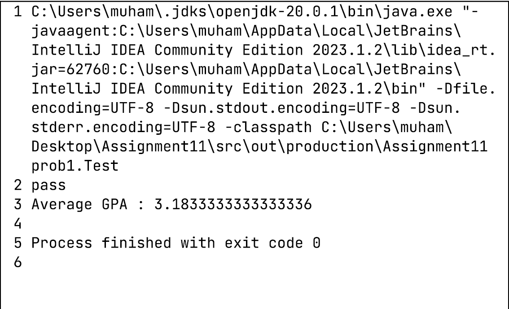

Assignment 11: Student Data Processing
============================================

Overview
--------

This project involves processing student data using Java data structures. It includes classes for representing students, keys, and an admin to process the student data.

File Structure
--------------

The project contains the following files:

*   `Student.java`: Represents a student with first name, last name, GPA, and class.
*   `Key.java`: Represents a key used for mapping students in the admin class.
*   `Admin.java`: Contains methods for processing student data.
*   `Test.java`: Contains a main method to test the functionality of the admin class.

Usage
-----

To use the project, follow these steps:

1.  Compile the Java files: `javac Student.java Key.java Admin.java Test.java`
2.  Run the program: `java prob1.Test`

Conclusion
-----------

Requirements
------------

*   Java Development Kit (JDK) installed
*   A Java IDE or a command-line interface to compile and run the Java files

Contributing
------------

Contributions are welcome! If you find any issues or have suggestions for improvements, please open an issue or submit a pull request on the project's GitHub repository.

License
-------

This project is licensed under the MIT License. See the `LICENSE` file for more details.
